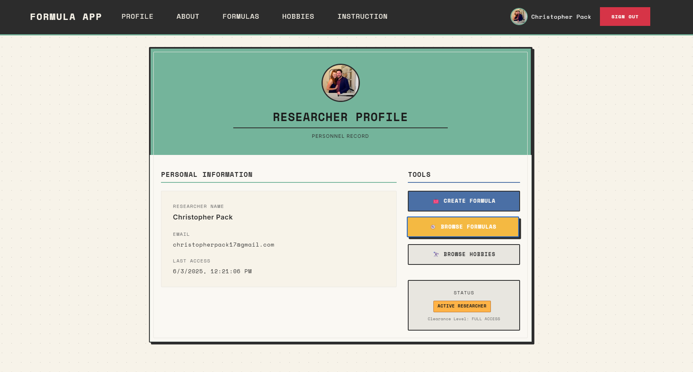

APP OF FORMULAS
OVERVIEW:
There are a growing number of people in this modern world that don't really get the chance to get their hands dirty anymore. People have lost touch with how things in the physical world works. And while chemistry or metallurgy might be super boring to a highschooler a lot of people grow up and wish they had more real-world knowledge.

This app aims to make this knowledge more obtainable. Here is a compilation of working formulas that range from how to make cheese to how to brush brass. And a user doesn't have to rely on random chance to find something they are interested in, the user can learn new things based on a specific hobby even if they didn't know what they needed to look for first.

This app hopes to educate and remove some of the mystery from the world that surrounds us, because understanding lifts us all up.

DESCRIPTION OF USER:
The ideal user of this app is someone who wants to learn how the world around them works. The ways they can do that include:
Allowing several users to create and share formulas.
Keep up with their hobbies and discover knwledge related to it.
The user has full customization of their own formulas.
The user can learn about new things every time they log in with a Random Formula feature.

WALKTHROUGH OF APP OF FORMULAS:
https://www.loom.com/share/60c72b3fbb45444794baf3cb16436f8e?sid=d979ae49-8e90-4997-88d5-466b2b2601af

WIREFRAME AND ERD:
https://app.diagrams.net/?splash=0#G119uXUVbwyVTeBRUapWFmBcFWqUv_DAfY#%7B%22pageId%22%3A%22yC0dfsThMRpy-qJWlGmE%22%7D
https://dbdiagram.io/d/app-of-formulas-682274325b2fc4582f494dad

MY PROJECT BOARD:
https://github.com/users/totallypack/projects/4/views/1

DEPLOYED:
https://appofformulas.netlify.app/

LESSONS LEARNED:
Learned to keep things labeled.
I learned a new way to read/write. https://firebase.google.com/docs/database/web/read-and-write
Learned about using @extend which enables me to write more semantic HTML markup. Instead of adding multiple Bootstrap utility classes directly in my HTML I can define a custom class in my CSS and extend the desired Bootstrap class.
Learned a lot more about CSS.
Learned a little more about hooks.
Learned a more detailed data structure in firebase that allows multiple people to hold a "favorites" status with a given object at the same time.

FIREBASE LEARNING RESOURCES:
Official Firebase Documentation:
Firebase Realtime Database - https://firebase.google.com/docs/database
Structure Your Database | Firebase Realtime Database - https://firebase.google.com/docs/database/web/structure-data
Saving Data | Firebase Realtime Database - https://firebase.google.com/docs/database/admin/save-data
Work with Lists of Data on the Web | Firebase Realtime Database - https://firebase.google.com/docs/database/web/lists-of-data
Optimize Database Performance | Firebase Realtime Database - https://firebase.google.com/docs/database/usage/optimize
Index Your Data | Firebase Realtime Database - https://firebase.google.com/docs/database/security/indexing-data
Understand Firebase Realtime Database Security Rules - https://firebase.google.com/docs/database/security
Use conditions in Realtime Database Security Rules - https://firebase.google.com/docs/database/security/rules-conditions
Realtime Database Limits | Firebase Realtime Database - https://firebase.google.com/docs/database/usage/limits
Scale with Multiple Databases | Firebase Realtime Database - https://firebase.google.com/docs/database/usage/sharding
Firebase Realtime Database | Store and sync data in realtime - https://firebase.google.com/products/realtime-database
GitHub Resources:
Common Database Rules for Firebase - https://gist.github.com/codediodeio/6dbce1305b9556c2136492522e2100f6
Stack Overflow & Development Communities
Firebase Realtime Database: Good Practice (Filter, Ordering, etc..) - https://stackoverflow.com/questions/65176802/firebase-realtime-database-good-practice-filter-ordering-etc
How to improve performance in Firebase real time database - https://stackoverflow.com/questions/57037239/how-to-improve-performance-in-firebase-real-time-database
Firebase RTDB: Read data using pagination takes a lot of time - https://stackoverflow.com/questions/79317527/firebase-rtdb-read-data-using-pagination-takes-a-lot-of-time
Developer Resources & Tutorials:
Denormalization: How, When and Why (part2) | Codementor - https://www.codementor.io/@nwankwo.c.michael/denormalization-how-when-and-why-part2-ciu7f6vnj
Firebase Realtime Database - Mindbowser - https://www.mindbowser.com/firebase-real-time-database/
Firebase Realtime Database - A Beginner's Guide for Ionic Developers - https://moldstud.com/articles/p-firebase-realtime-database-a-beginners-guide-for-ionic-developers
Introduction | Full-Stack Firebase - https://www.fullstackfirebase.com/realtime-database/introduction
3 Pillars Only Senior Developers Know About Firebase and Firestore Databases - https://dev.to/this-is-learning/3-pillars-only-senior-developers-know-about-firebase-and-firestore-databases-oe0

CONTRIBUTORS:
Christopher Pack https://github.com/totallypack
